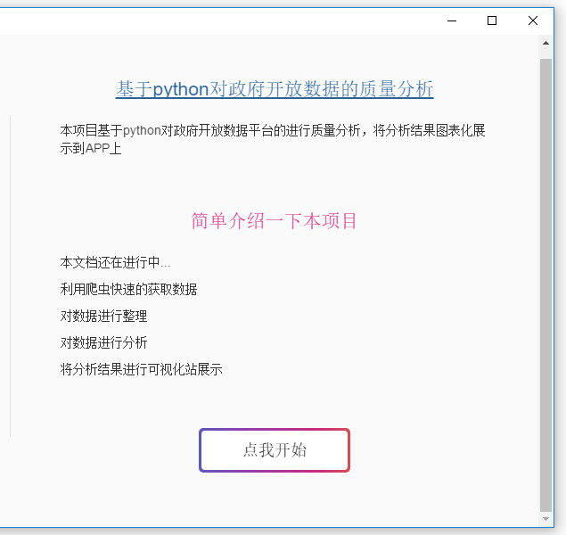
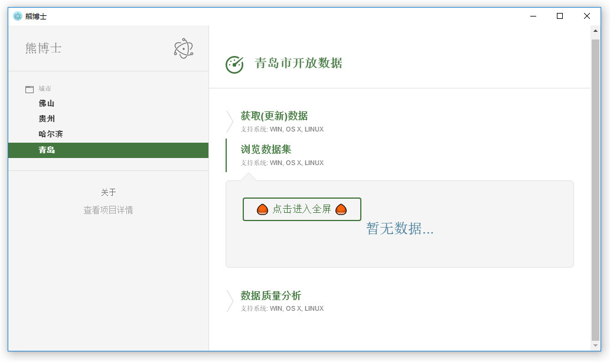

## 基于python爬虫对政府开放数据平台数据质量分析 
---
---

*	利用爬虫快速的获取数据
*	对数据进行整理
  * 对其中的空值标记并填充null值，对不规格的日期数据进行格式化并一通统计
*	对数据进行质量分析
  * 统计分析脏数据的占比
*	将分析结果展示
  * 利用echart.js将分析结果自动化展示

  . 展示抓取过程 
  
  . 展示数据集 
  
  
  
  . 展示分析结果 
  .....开发中
  
---
  待更新...
